# Zomato User Guide

## Introduction
Zomato is an online platform that allows users to search for restaurants, explore menus, read reviews, and order food for delivery or takeout. This guide outlines the steps to navigate Zomato’s core features, from logging in to managing your account settings.

---

## 1. Log In

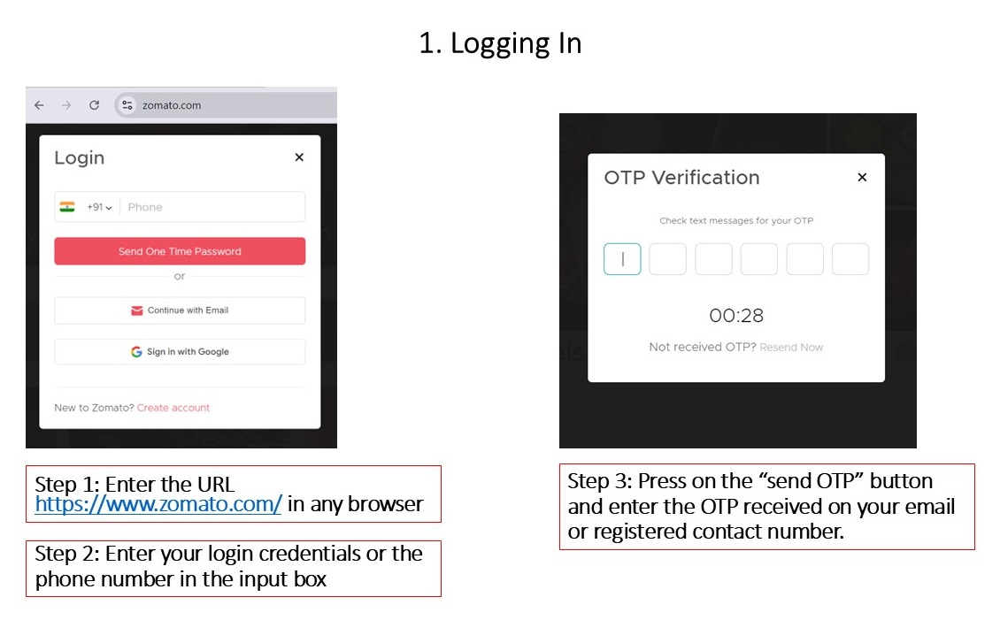

Logging in to Zomato gives you access to personalized features:

1. Go to [Zomato.com](https://www.zomato.com).
2. Click the **Sign In** button at the top-right corner.
3. Enter your email and password or sign in using a Google, Facebook, or Apple account. Once you input all details, press the **Send One Time Password** button.
4. Enter the OTP, and you will be logged in to your account. Once logged in, you will be redirected to the homepage.

---

## 2. Homepage

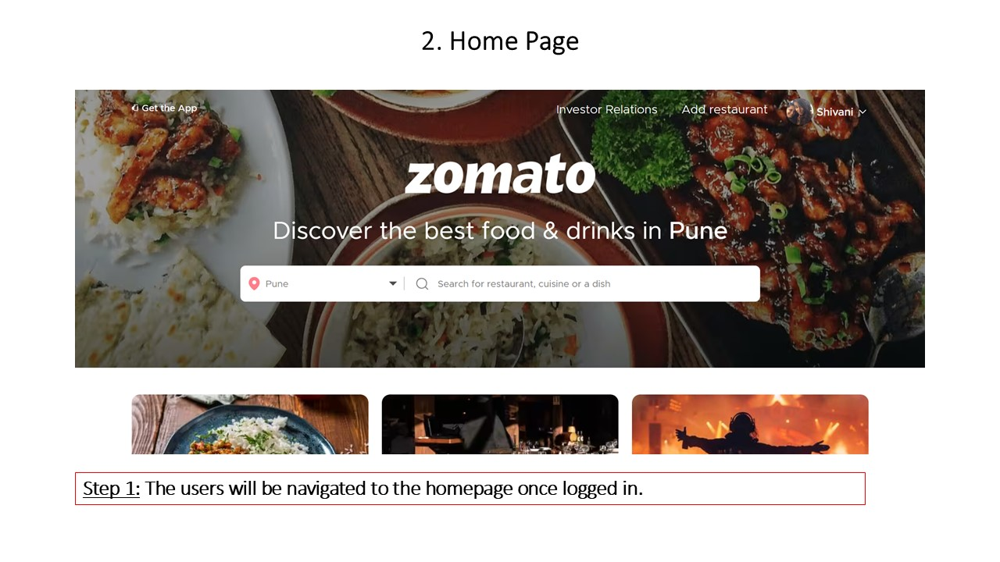

When you are redirected to the homepage, start by exploring the menus on the page, including the food search menu, user profile options, etc.

---

## 3. Food Search

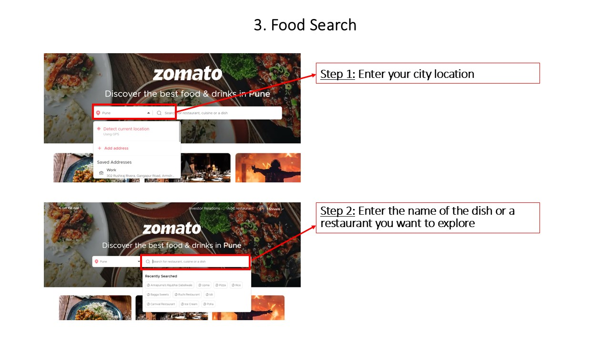

To search for a specific restaurant or type of food:

1. Click the search bar in the middle of the homepage and input your location. For example, "Pune."
2. Type the name of a restaurant, dish, or cuisine.

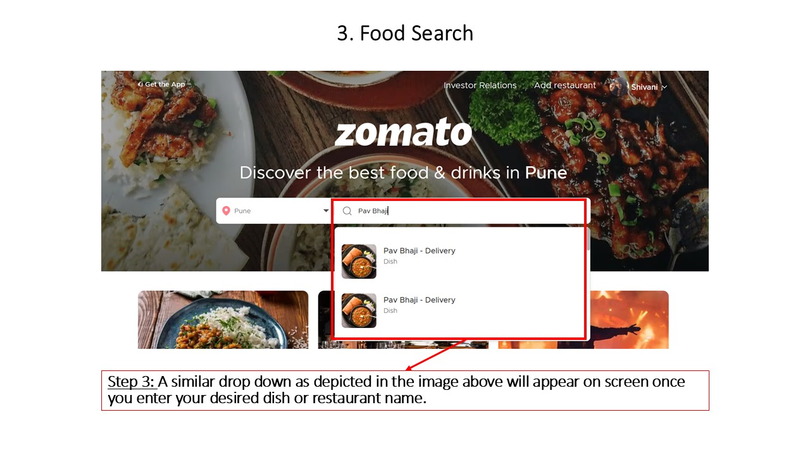

3. Select the dish you want to order from the dropdown. Once you click on the desired dish, you will be redirected to the "restaurants" page.

---

## 4. Exploring Restaurant Options

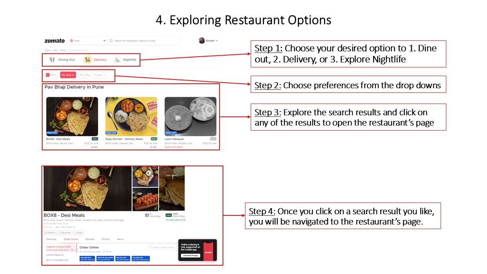

Once you have searched for food or restaurants, you can explore the results:

1. Browse through the list of restaurants that match your search. You can choose your desired option from **Dine Out**, **Delivery**, and **Explore Nightlife**, etc.
2. Use filters to refine results by ratings, delivery time, price range, distance, and more.
3. Click on any restaurant to view more details about it.

---

### 4.1 Exploring Restaurant’s Pages

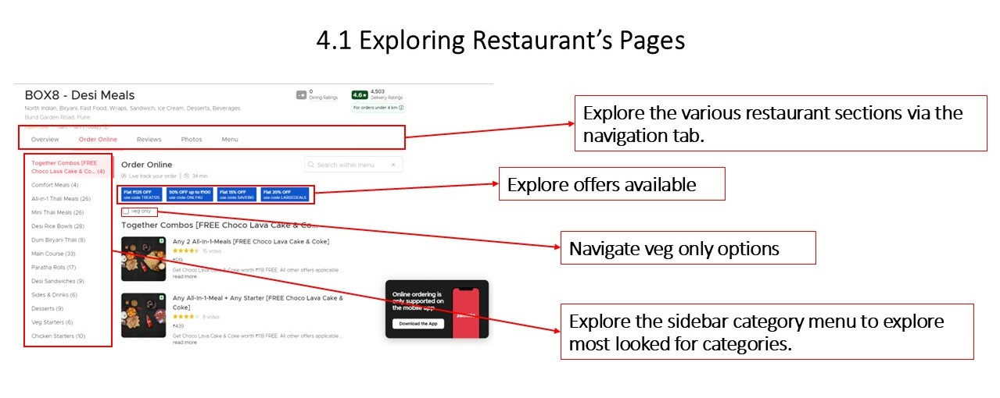

After selecting a restaurant, you’ll be taken to the restaurant’s page where you can find more information about the restaurant.

---

### 4.2 Restaurant Overview

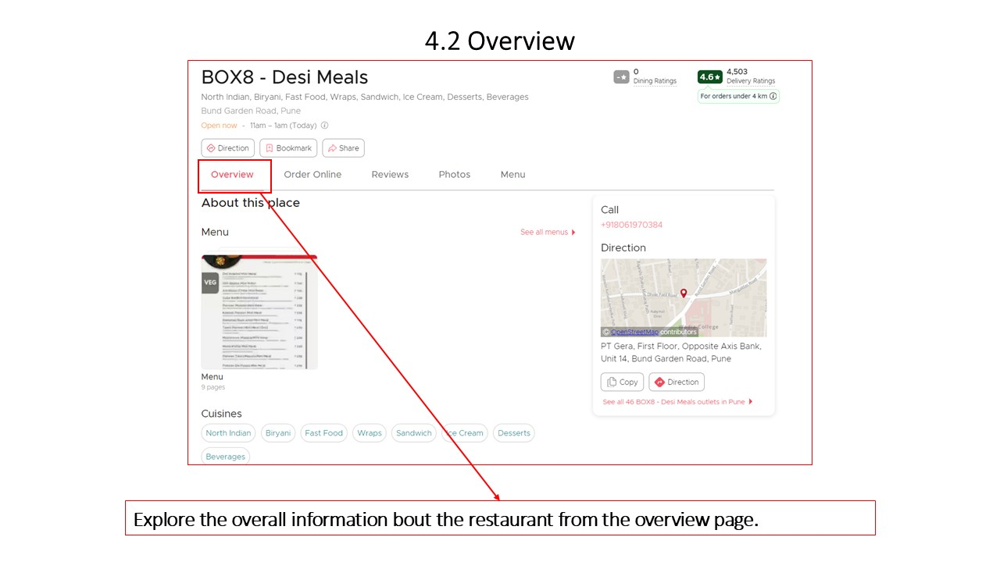

In the **Overview** section, you can view:

- Basic details about the restaurant.
- **Menu**: See the dishes available for delivery or takeout.
- **Reviews**: Customer feedback on food and service.
- **Photos**: Images of the food, ambiance, and interiors.

---

### 4.3 Online Menu

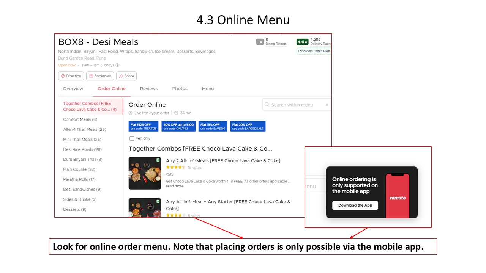

To view and order from the restaurant’s menu online:

1. Click on the **Menu** tab on the restaurant’s page.
2. The menu will show available dishes with descriptions and prices.
3. If online ordering is available, use the **Order Online** button to place an order directly.

> **Note:** Online ordering is only available via the mobile app.

---

### 4.4 Reviews

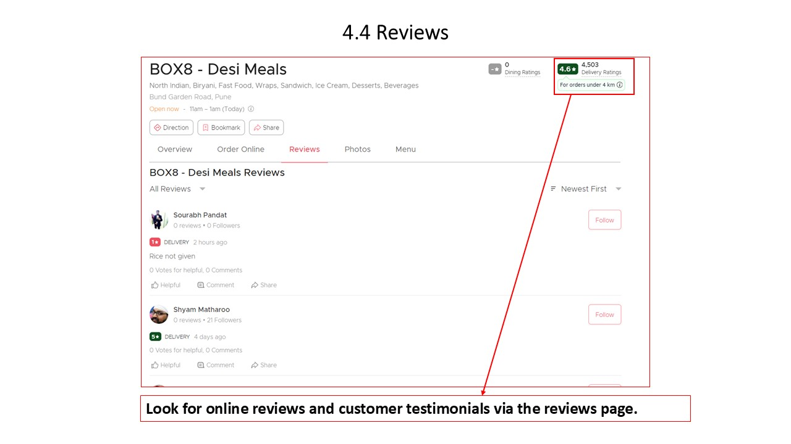

To read customer reviews:

1. Visit the **Reviews** section of the restaurant’s page.
2. Browse individual reviews or sort by rating, time posted, or relevant dishes.

---

### 4.5 Photos

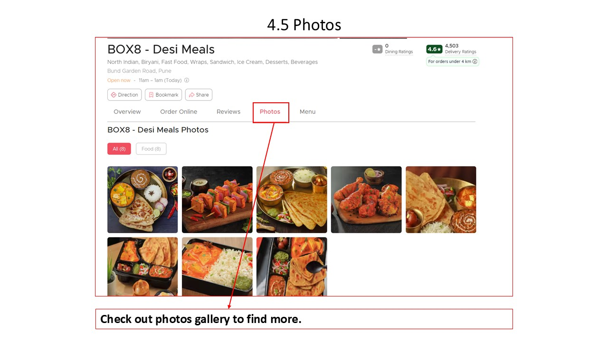

To explore photos of the restaurant:

1. Go to the **Photos** tab.
2. Scroll through images uploaded by customers and the restaurant itself.
3. Click on any image for an enlarged view or more details.

---

### 4.6 Menu (Dine-In)

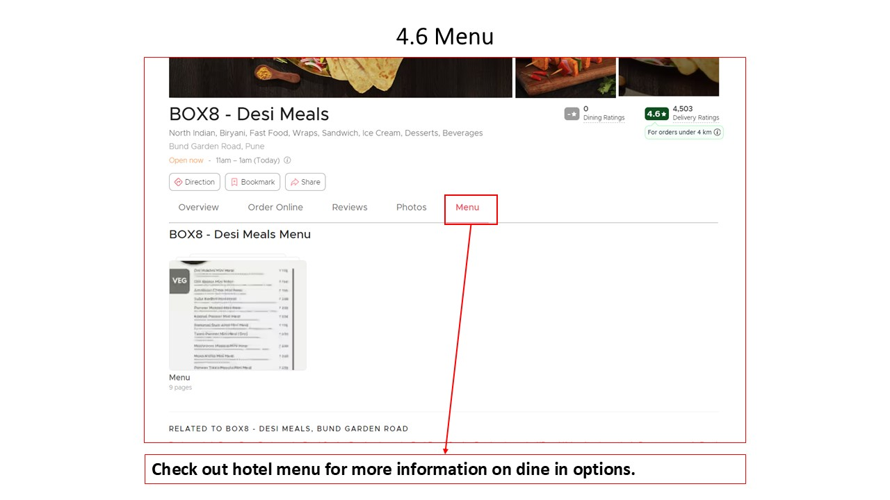

If you are planning to dine in, you can check the dine-in menu:

1. Go to the **Dine-In Menu** section of the restaurant’s page.
2. This menu lists available dishes and may differ from the online ordering menu.

---

## 5. Log Out & Settings Menu

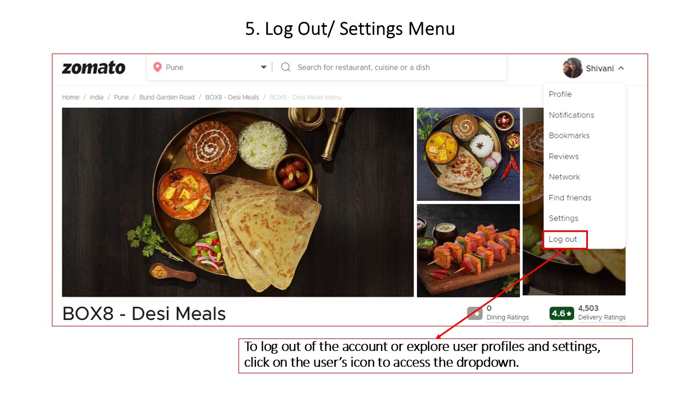

To log out or adjust account settings:

1. Click on your profile icon in the top-right corner.
2. From the drop-down menu, select **Settings** to adjust your account preferences, manage payment options, or update delivery addresses.
3. To log out, select the **Log Out** option from the same drop-down menu.

## 6. Happy Ordering!

Now that you have understood how to use the website, you are free to download the mobile app and explore it further to place your order!
